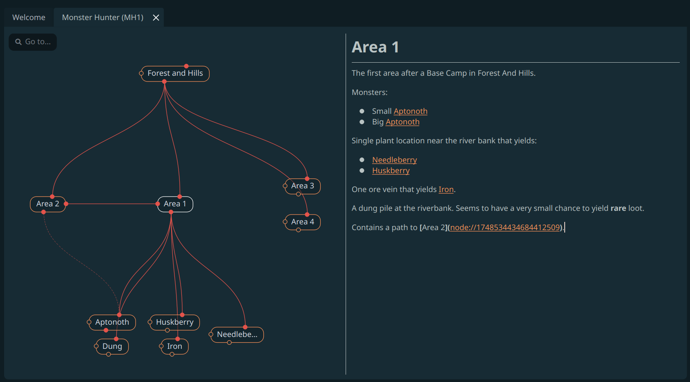

## Brainlet

Brainlet (working title) is a graph-based thought organizer for Linux. It is
heavily inspired by an excellent program called
[TheBrain](https://www.thebrain.com/), and was born out of desire to have a
similar experience, but made as a native Linux app.

### Work in progress

This is a hobby project made by a single developer mostly as an excercise to
learn Qt and C++. It doesn't have a lot of features, probably has a lot of bugs,
and is expected to get breaking changes during development. Use at your own
risk, I can't at this stage guarantee any stability or backwards compatibility.

You can file any feature requests or bugs via Github's Issues tab. I will try
to look into them as often as I can.

### Data and data locations

The app allows you to create multiple "brains", each is saved in its own
directory within the main documents location. By default, on Linux the base
directory is `~/.config/brainlet/brains`. On Mac OS, it is
`~/Documents/Brainlet/brains`.

Each brain consists of an Sqlite database file which stores nodes and
connections, and `documents` folder, which stores notes on each node in
Markdown format. There's no encryption or any other sort of data protection
emplaced, so be careful not to share these files in the open or not to store
any sensitive info in them.

### No data collection

Everything the app does is done locally. No usage or any kind of analytics data
is collected. If I introduce something like that later, I will make sure to
notify you about it and make it easy to opt-in or opt-out.

### Build requirements

The app is built using Qt 6.8.2 framework, but should be compatible with any
Qt6 version. For building, you need Qt6 development packages installed on your
system.

Makefile makes use of `pkg-config` utility, which most likely is installed
by default on most Linux distributions.

On Mac, you'll need to install `qt6` and probably `clang` packages via Homebrew
or something similar.

### Building

See inside the Makefile to change build settings. On top of the file there's a
`PREFIX` variable that points to final install location prefix.

Simple `make` or `make app` will create a `build` output directory and produce
an executable, a desktop entry file and an app icon.

`make install` will copy the files into relevant subdirs in the `PREFIX` path.

### License

MIT License.
